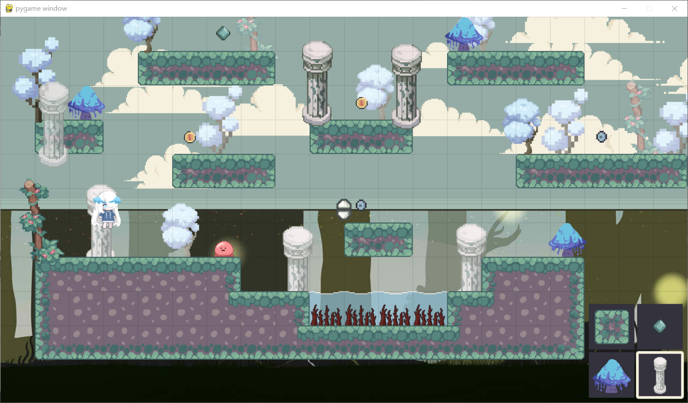
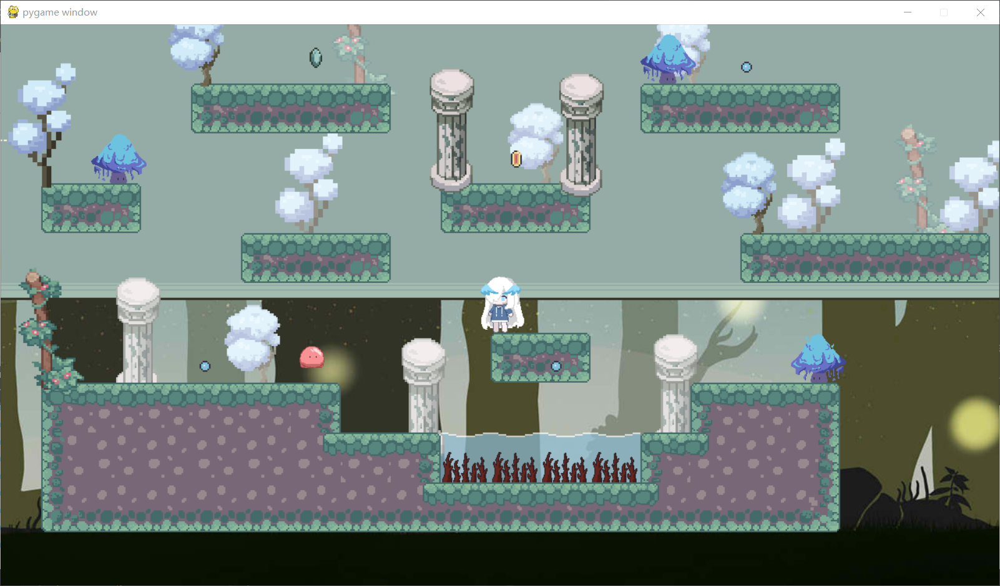

#  1.1说明: 
#  《Bluebird》：内含编辑器的自定义2D横版像素跑酷游戏 
团队分工： 
谷思菀：程序、UI优化 
陸昱澄：场景+道具美术 
余泳仪：角色+敌人美术、背景 
#  游戏玩法： 
长按鼠标中键移动屏幕，鼠标左键编辑，鼠标右键删除，鼠标左键长按拖动 
菜单栏中鼠标左键选中，鼠标右键切换菜单 鼠标中键切换远景物体  
回车键创建关卡  
Esc键返回编辑器 ← →控制玩家移动 空格键跳跃 
预览图片——编辑器： 

预览图片——进入关卡： 

展示视频： 
<video width="320" height="240" controls>
  <source src="3" type="video/mp4">
  Your browser does not support the video tag.
</video>
